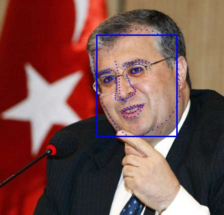

# Tengine-Lite NPU 

# 介绍
Tengine-Lite目前在khadas上支持npu运行人脸检测和人脸关键点。通过npu运行算法可以更高效的得到你所需的结果。目前仅支持khadas的开发板。

## 功能 
- 人脸检测
- 人脸关键点

## 性能
人脸检测 ：< 1ms        
人脸关键点 ： < 1ms     

## 所需内容
- khadas开发板一块
- khadas npu sdk[如何获取](#jump)

# 快速使用
## 编译
你可以在```Khadas/sample/Face```文件夹下：
```bash
rm -rf ./build
mkdir build
cd build

rm -rf ./bin
mkdir bin

build_file="Face"

cmake ../ \
-DBUILD_FILE=$build_file \
-DCMAKE_BUILD_TYPE=Release

make -j4
```
或者直接运行```make.sh```bash文件
```bash
./make.sh
```

## 运行
运行测试图片：
```
./bin/Face ./resources/4.jpg
```

## 运行结果


<span id="jump">#获取khadas npu sdk</span>
1. ) 跳转到[khads官网](https://www.khadas.cn/)
2. ) 联系客服要npu的sdk
3. ) 放到khadas板子位置，并export VIVANTE_SDK_DIR=$sdk路径