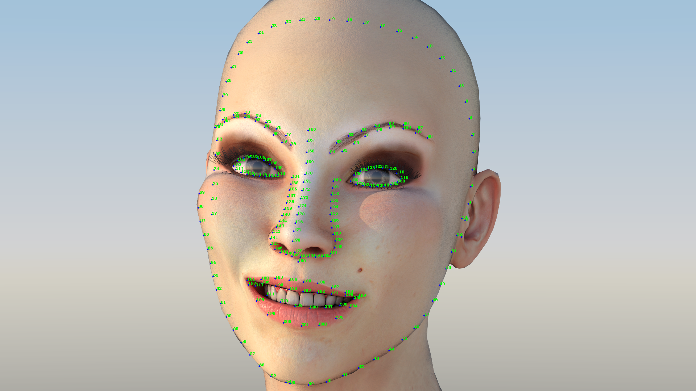

# Landmark 关键点顺序

# Landmark顺序说明：
| 顺序 | 注释 |
| :---: | :---: |
| 1 - 37| 面部上半部分轮廓关键点。从右耳附近起始到左耳附近终，按逆时针顺序检测到的位置序列 |
| 38 - 53 | 面部下半部分右边轮廓关键点。从下巴起始到右耳附近，按逆时针顺序检测到的位置序列 |
| 54 - 69 | 面部下半部分左边轮廓关键点。从下巴起始到左耳附近，按顺时针顺序检测到的位置序列|
| 70 - 85 | 从左眉左端中心位置起始，按顺时针顺序检测到的左眉关键点位置序列 |
| 86 - 101 | 从右眉右端中心位置起始，按逆时针顺序检测到的右眉关键点位置序列 |
| 102 - 117 | 从左眼左端中心位置起始，按顺时针顺序检测到的左眼关键点位置序列 |
| 118 - 133 | 从右眼右端中心位置起始，按逆时针顺序检测到的右眼关键点位置序列 |
| 134 - 149 | 从鼻子上部左端位置起始到鼻尖，顺序检测到的鼻子关键点位置序列 |
| 150 - 165 | 从鼻子上部右端端位置起始到鼻尖，顺序检测到的鼻子关键点位置序列 |
| 166 - 180 | 从眉心中间到人中，从上到下顺序检测到的鼻子中线关键点位置序列 |
| 181 - 189 | 上嘴唇的上边缘。从左边嘴角开始，从左到右检测到的上嘴唇上边缘关键点位置序列 |
| 190 - 196 | 上嘴唇的下边缘。从右到左检测到的上嘴唇下边缘关键点位置序列 |
| 197 - 205 | 下嘴唇的下边缘。从左边嘴角开始，从左到右检测到的下嘴唇下边缘关键点位置序列 |
| 206 - 212 | 下嘴唇的上边缘。从右到左检测到的下嘴唇上边缘关键点位置序列 |